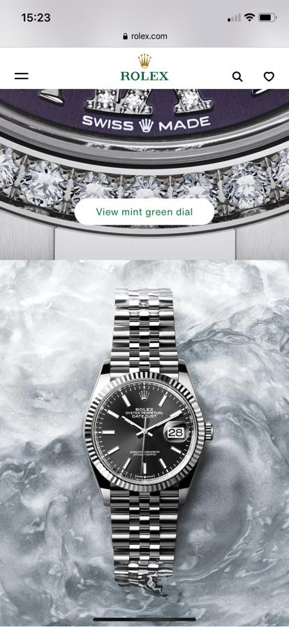

# Procesverslag
**Auteur:** -jouw naam-

Markdown cheat cheet: [Hulp bij het schrijven van Markdown](https://github.com/adam-p/markdown-here/wiki/Markdown-Cheatsheet). Nb. de standaardstructuur en de spartaanse opmaak zijn helemaal prima. Het gaat om de inhoud van je procesverslag. Besteedt de tijd voor pracht en praal aan je website.

## Bronnenlijst
1. -bron 1-
2. -bron 2-
3. -...-

## Eindgesprek (week 7/8)

-dit ging goed & dit was lastig-

**Screenshot(s):**

-screenshot(s) van je eindresultaat-

## Voortgang 3 (week 6)

-same as voortgang 1-

## Voortgang 2 (week 5)

-same as voortgang 1-
### Stand van zaken

 Wat beter ging als vorige keer is het centreren van items daar liep ik vorige week erg tegenaan, het lukte niet helemaal. Nu heb ik dat wel onder controle. Wat ik deze weken vooral lastig vond/vind is het opletten op div's en classes en dat ik daar niet te veel van gebruik. Ben zelf namelijk gewent om het gewoon te gebruiken en nu moet je daar toch opletten en er andere oplossingen voor zoeken. Voor de volgende voortgang wil me gaan focussen op de responsiveness en animaties ook wil de website nog polijsten kleine dingen verbeteren waar ik me aan irriteer als laaste hoopte ik nog iets te doen met Javascript. 

**Screenshot(s):**

## Voortgang 1 (week 3)

### Stand van zaken

 Wat ik vooral lastig vond is nog steeds het centreren van elementen. Ik wist het soms op te lossen met: transform:translate. Ook het bepalen van de hoogtes van mijn secties snapte ik niet zo goed dit heb ik uiteindelijk opgelost met vw en vh. 
 
overal: Ik vind coderen best lastig maar weet het eindelijk na veel onderzoeken op te lossen. Ik ben nu bezig met een uitklap menu. En nog het centreren van tekst op bepalen delen van mijn pagina. 

**Screenshot(s):**

### Agenda voor meeting

-samen met je groepje opstellen-

| student 1      | student 2          | student 3    | student 4        |
| ---            | ---                | ---          | ---              |
| dit bespreken  | en dit             | en ik dit    | en dan ik dat    |
| an dat ook nog | dit als er tijd is | nog een punt | dit wil ik zeker |
| ...            | ...                | ...          | ...              |

### Verslag van meeting

-na afloop snel uitkomsten vastleggen-

## Breakdownschets (week 1)

## Intake (week 1)
-uitwerken voor de kick-off werkgroep - begin van de eerste week-

**Je startniveau:** - rood -

**Je focus:** - Surface Plan -    

**Je opdracht:** - Ik wil de website van Rolex namaken. URL's: https: https://www.rolex.com/ (homescreen) - 
https://www.rolex.com/watches/datejust.html (detail-pagina) - 

**Screenshot(s) van de eerste pagina (small screen):**

**Screenshot(s) van de tweede pagina (small screen):**

