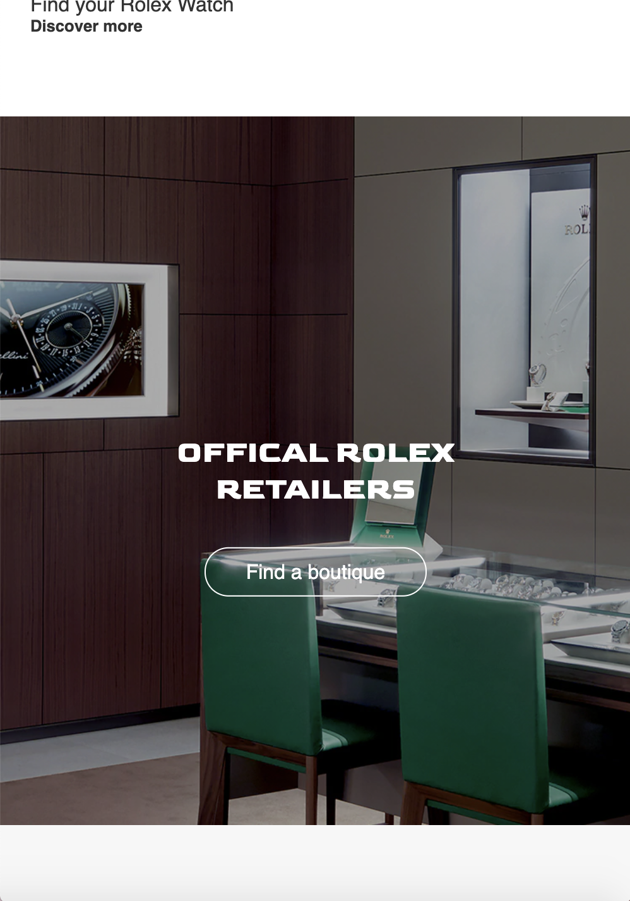
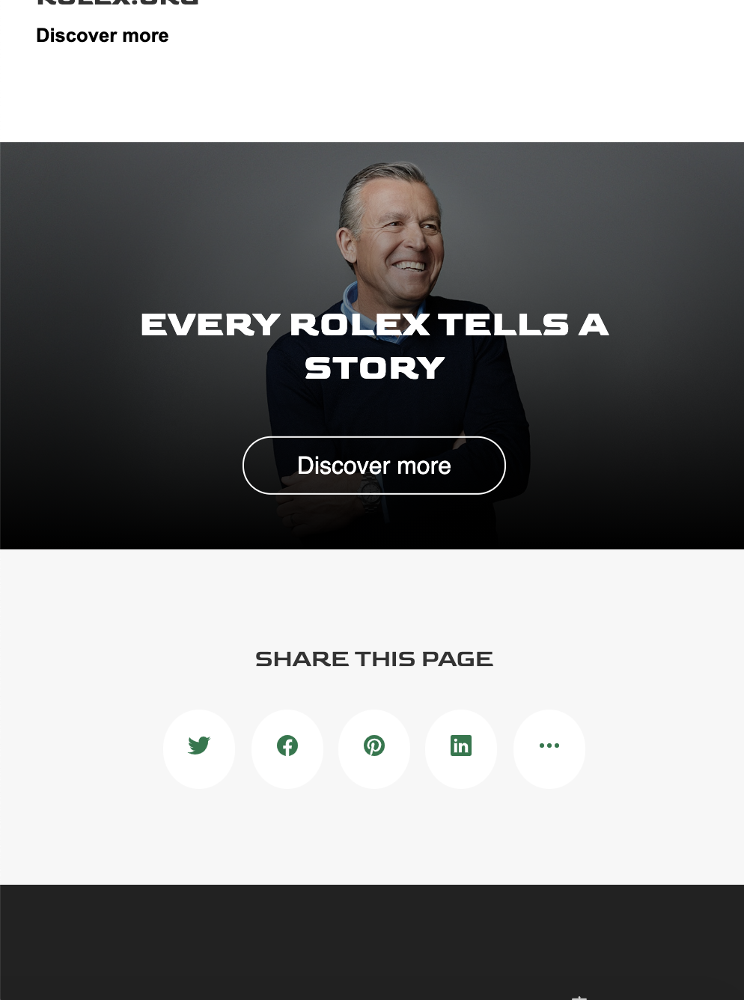
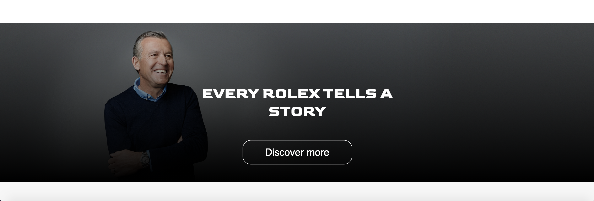
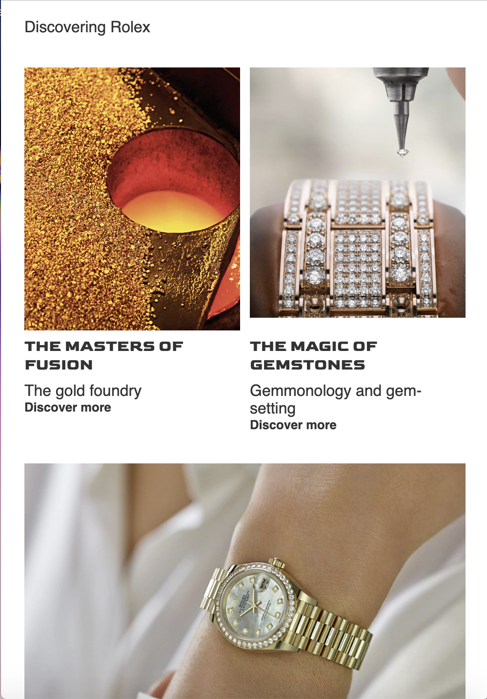
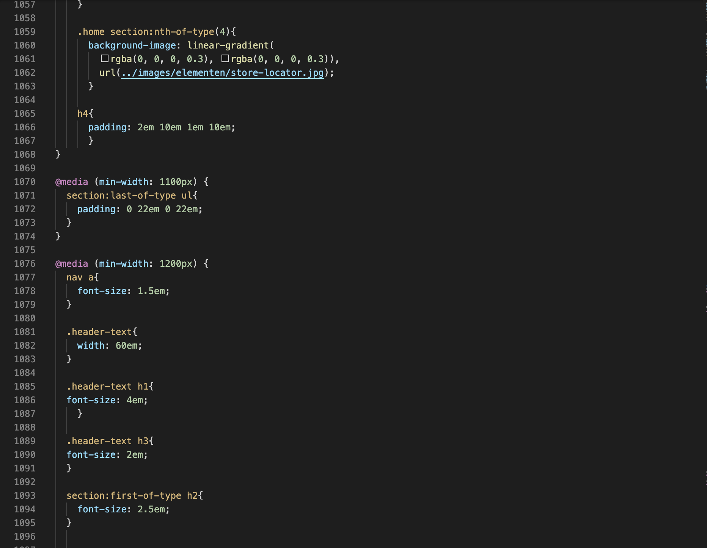
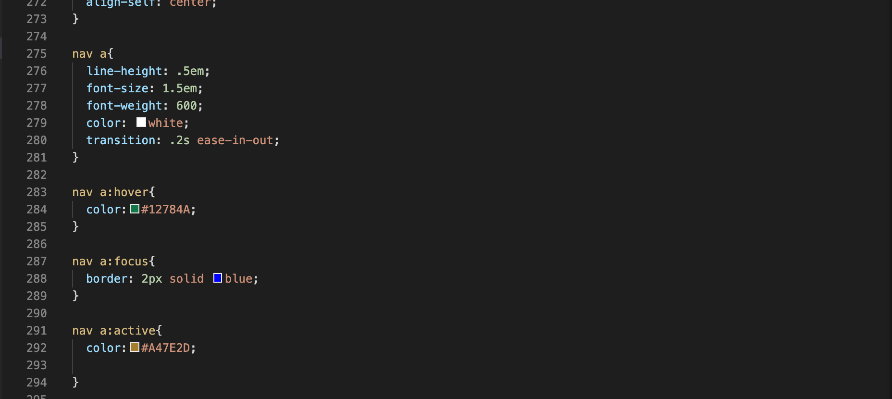
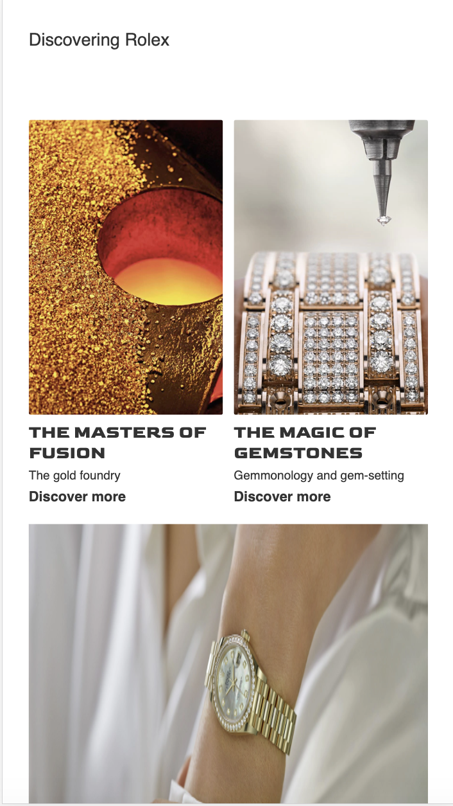

# Procesverslag
**Auteur:** Tristan Varewijck

## Bronnenlijst
1. Background-image linear-gradient. Bron: https://www.w3schools.com/cssref/func_linear-gradient.asp
2. Verstopte menu. Bron: https://codepen.io/shooft/pen/PoNQwXY 
3. Fixed Position. Bron: https://www.w3schools.com/css/css_positioning.asp*/ 
4. Het stylen van de scrollbar. Bron: https://css-tricks.com/the-current-state-of-styling-scrollbars/
5. Header tekst in het midden. Bron: https://stackoverflow.com/questions/42121150/css-centering-with-transform  */
7. Slider met Flexbox. Bron: https://dlo.mijnhva.nl/content/enforced/192710-FDMCI-2000FED1
16-DMCI-CMD-2021-1/FED%2020-21%20-%20Blok%202%20-%20Oefening%20flexbox.pdf*/
8. Hover animation ease-out. Bron: https://css-tricks.com/almanac/properties/t/transition/ */
9. Grid. Bron: https://dlo.mijnhva.nl/content/enforced/192710-FDMCI-2000FED116-DMCI-CMD-2021-1/FED%2020-21%20-%20Blok%202%20-%20Oefening%20grid.pdf.
Bron: https://css-tricks.com/snippets/css/complete-guide-grid/
Bron: https://www.youtube.com/watch?v=br-0i3U1VCA&feature=youtu.be
10. @media om het responsive te maken. Bron: https://dlo.mijnhva.nl/content/enforced
  /192710-FDMCI-2000FDMCI-CMD-2021-1/FED%2020-21%20-%20Blok%202%20-%20Oefening%20media%20queries.pdf
  Bron: https://www.youtube.com/watch?v=2KL-z9A56SQ&feature=youtu.be 
11. Algemene dingetjes. Bron: https://developer.mozilla.org/nl/
12. Algemene dingetjes. Bron: https://www.w3schools.com/
13. Javascript. Bron: https://dlo.mijnhva.nl/content/enforced/192710-FDMCI-2000FED116-DMCI-CMD-2021-1/FED%2020-21%20-%20Blok%202%20-%20Oefening%20JS%203-stap.pdf
14. Keyframes. Bron: https://www.w3schools.com/cssref/tryit.asp?filename=trycss3_keyframes 
15. Icons. Bron: ionicons.com  
16. Alle gebruikte foto's los van de header-foto's komen van https://www.rolex.com/. 
17. Header foto pagina 1. Bron: https://www.pexels.com/nl-nl/foto/aantal-analoog-cameralens-chroom-364822/
18. Header foto pagina 2. Bron: https://www.pexels.com/nl-nl/foto/wagens-weg-landschap-lichten-3136673/ 
19. Gebruikte Fonts komen van Google Fonts. Bron: https://fonts.google.com/
20. HTML validator: https://validator.w3.org/
21. CSS validator:  https://jigsaw.w3.org/css-validator/
22. JS Validator:   https://codebeautify.org/jsvalidate

## Eindgesprek (week 7/8)

 De website is af. Ik heb de laaste dagen gewerkt aan het verder responsive maken totdat ik vind dat de 
website op een correcte manier responsive is en alle elementen goed op zijn plaats vallen door telkens de maximale en minimale grootte te bepalen. Dit duurde wel een tijdje maar het ging me uiteindelijk goed af, 
het is naar mijn mening goed gelukt. Daarnaast ben ik bezig geweest om er voor te zorgen dat de website doormiddel
van "tabben" door te lopen. Dit is gelukt maar wel meer werk dan ik dacht. Wat ik lastig vond was het beslissen of ik nog meer animaties wilde maar ik kreeg meer het gevoel dat ik er dus naar aan het zoeken was los van dat ik aan het kijken was of het wel op de website past daarom heb ik een aantal animaties weggehaald en een paar subtiele animaties toegevoegd. Als laasts heb ik de puntjes op de "i" gezet door kleine irritatie puntjes op te lossen zoals kwaliteit van de foto's maar ook wat er met die foto's gebeurd als het scherm dus veranderd. Voor mijn volgende project wil ik me graag meer focussen op JS dit heb ik dit blok stiekem een beetje ontlopen maar wil ik volgend blok wel in groeien wanneer ik mee doe aan Project Tech. 

## Voortgang 3 (week 6)

 De website is zo goed als af en heeft nu nog verzorging nodig. De Media Queries moeten nog goed gemaakt worden en de code is nog niet helemaal correct zoals het hoort zo heb ik te veel classes en een aantal div's die nog op een semantische wijze opgelost kunnen worden, ook staan er nog elementen niet op de juiste plek die ik voor het laatst had bewaard en waar ik nu dus aan moet werken. Wat goed ging deze week is het maken van een responsive header en het responsive maken over het algemeen. Het polijsten het verbeteren van kleine dingen ging ook heel goed en durf dus ook wel te zeggen dat ik vind dat de website er al goed uit begint te zien. Voor volgende week ga ik me focussen op mijn code en het responsive maken voor grote schermen. 

## Voortgang 2 (week 5)

 Wat beter ging als vorige keer is het centreren van items. Daar liep ik vorige week tegenaan, nu heb ik dat wel onder controle. Wat ik deze weken vooral lastig vondt is het opletten op div's en classes en dat ik daar niet te veel van gebruik. Ben namelijk gewend om het gewoon te gebruiken en nu moet je daar toch opletten en er andere oplossingen voor zoeken. Voor de volgende voortgang wil ik me gaan focussen op de responsiveness en animaties en wil ik de website polijsten, kleine dingen verbeteren waar ik me aan irriteer als laaste hoopte ik nog iets te doen met Javascript. 

## Voortgang 1 (week 3)

 Wat ik vooral lastig vind is het centreren van elementen. Ik weet dat je het kan oplossen met: transform:translate of met calc() maar toch lukt dit niet in 1 keer. Ook het bepalen van de hoogtes van mijn secties snapte ik niet zo goed. Dit heb ik uiteindelijk opgelost met vw en vh.
 
Over het algemeen vindt ik coderen best lastig maar weet dingetjes uiteindelijk wel op te lossen. Ik ben nu bezig met een uitklap menu en het centreren van tekst op bepaale delen van mijn pagina. 

<!-- ### Agenda voor meeting

-samen met je groepje opstellen-

| student 1      | student 2          | student 3    | student 4        |
| ---            | ---                | ---          | ---              |
| dit bespreken  | en dit             | en ik dit    | en dan ik dat    |
| an dat ook nog | dit als er tijd is | nog een punt | dit wil ik zeker |
| ...            | ...                | ...          | ...              |

### Verslag van meeting

-na afloop snel uitkomsten vastleggen-
-->

## Breakdownschets (week 1)

## Intake (week 1)
-uitwerken voor de kick-off werkgroep - begin van de eerste week-

**Je startniveau:** - rood -

**Je focus:** - Responsiveness -    

**Je opdracht:** - Ik wil de website van Rolex namaken. URL's: https: https://www.rolex.com/ (homescreen) - 
https://www.rolex.com/watches/datejust.html (detail-pagina) - 

**Screenshot(s) van de eerste pagina (small screen):**

**Screenshot(s) van de tweede pagina (small screen):**

